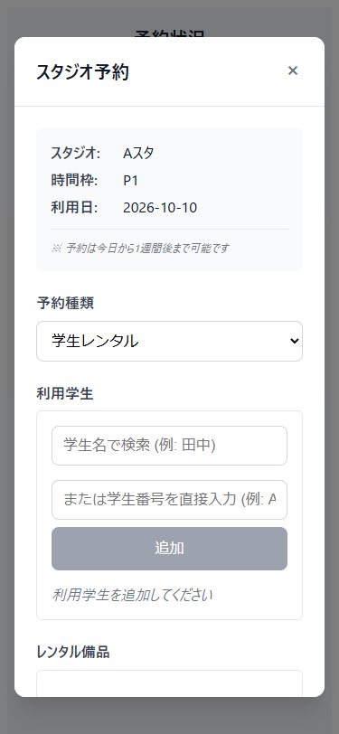
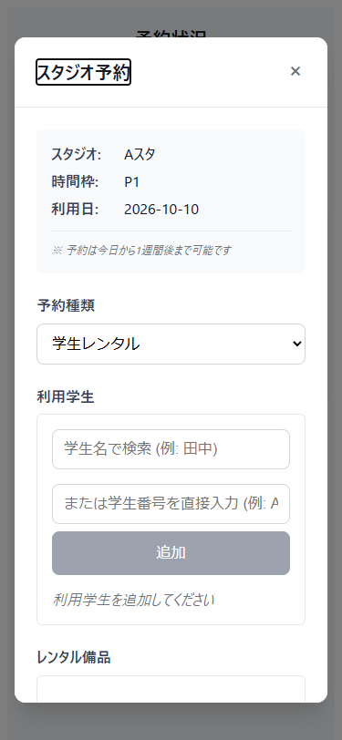

# 予約入力と結果表示のキーボード操作

2026-10-10 UTCに、接続されたWindows PCのEdgeをPlaywrightから起動して確認した。画面はローカルのViteで描画し、APIには架空の応答を返した。外部のブラウザ環境は使っていない。

## 確認した問題

PR #38の空き枠をEnterで選ぶと予約入力は表示されるが、フォーカスが背景の空き枠に残っていた。入力画面の見出しへ移動するテストは失敗した。結果メッセージもダイアログとして認識されず、キーボードだけでは入力と一覧の往復が分かりにくかった。

18〜20歳の学生がスマートフォンやキーボードで予約を確認する場面を想定し、装飾を増やすよりも、開いた画面と現在の操作位置が一致する改善を選んだ。年齢層を対象にしたユーザーテストは実施していない。

## 参考と採用範囲

- [W3C APGのモーダルダイアログ](https://www.w3.org/WAI/ARIA/apg/patterns/dialog-modal/)を、初期フォーカス、Tabの循環、Escape、閉じた後の復帰先の基準にした。
- [MDNのdialog要素](https://developer.mozilla.org/en-US/docs/Web/HTML/Reference/Elements/dialog)で、showModalによる背景の操作制限とブラウザ標準の振る舞いを確認した。

両資料は2026-10-10に参照した。参考画面の配色や配置は複製していない。長い入力画面では、先頭の見出しを初期フォーカスにして予約情報から読めるようにした。

## 設計

| 提案ID | 対象と責務 | 依存・理由 | トレードオフ |
|---|---|---|---|
| PROP-modal-presentation | ModalDialogが表示、背景の操作制限、キーボード移動、閉じる要求を扱う | BookingDialogとMessageDialogから呼ぶ表示層の部品。予約ルールやHTTP通信を持たない | ブラウザ標準を使える一方、対象ブラウザでの確認が必要 |
| PROP-return-focus | 通常は起点の枠へ戻し、一覧の再描画で起点が消えたら予約状況の見出しへ戻す | 復帰先はSchedulePageが指定する。共通部品はページのDOM構成を知らない | 完了後は以前の枠ではなく一覧の先頭から操作する |

表示の開閉は親のisVisibleを正とする。Escapeと背景タップはcloseイベントを通知し、既存の閉じる処理を通す。MessageDialogのshowCloseButtonがfalseなら、この2操作で閉じない。DOMへの副作用は表示部品内に置いた。集約・業務状態・権限の変更はないため、用語帳の追加は不要。

「予約確定」「予約完了」の業務上の意味と承認待ちの仕様はIssue #31などで確認中であり、この変更では決めていない。既存のPOST後の動作をモックで検証したことは、承認仕様を実装したことを意味しない。

## TDDと検証

| 段階 | 実際のRed | Green |
|---|---|---|
| 1 | 入力を開いた後、見出しがinactiveで失敗 | 入力をnative dialogへ移し、見出しの初期フォーカスとEscape・復帰を確認。1件成功 |
| 2 | HTTP 503後に予約エラーという名前のdialogが見つからず失敗 | 結果表示にも適用。エラーを閉じて再度入力を開くまで2件成功 |
| 3 | 一覧再描画後の復帰先とShift+Tabの循環の2件が失敗 | 復帰先の指定とTabの端での循環を追加し4件成功 |

上記の後に、320px、ブラウザ履歴移動、備品の読込中・503・再試行の3件を追加した。これらは最初から成功した補足検証であり、Redの回数に含めない。共通部品の責務を確認し、2画面の古いオーバーレイCSSと未使用の背景クリック関数を除いた。追加の業務抽象化は行っていない。

最終確認はstudio-frontendで実行した。

- `npm run test:ui -- --reporter=line`は12件成功。今回の7件とPR #38の5件を含む。
- `npm run build`は成功。
- 375pxの変更前後の画面を保存し、見出しのフォーカス表示とレイアウトを目視確認した。320pxでは横にはみ出さず、スクロール後のキャンセルボタンが画面内に入ることも確認した。
- キャンセル、Escape、背景タップ、反復開閉、背景へのfocus要求の抑止、TabとShift+Tab、予約結果の成功・失敗を確認した。
- ブラウザの「戻る」は入力を閉じる操作とは別に、/scheduleから/pingへ移動することを確認した。「進む」で戻った後も入力を開閉できた。履歴の仕様は変更していない。

型検査・lintの実行スクリプトとvue-tsc依存は既存プロジェクトにないため実施していない。Viteの成功は型検査の成功とは扱わない。実API接続、認証、メール、永続化、実機スマートフォン、スクリーンリーダー、Safari・Firefoxは未検証。UIだけの変更のためバックエンドのテストは再実行していない。既存テストの一部では備品APIを置き換えていないため、Viteに接続失敗のログが出るが、12件は成功している。

## 画面の記録

| 変更前 | 変更後 |
|---|---|
|  |  |

## レビュー手順

1. 空き枠をキーボードで開き、見出しにフォーカスがあることを確認する。
2. TabとShift+Tabで移動する。入力と結果の各モーダルから背景へ移動せず、Escapeで閉じられることを確認する。
3. キャンセル後の元の枠への復帰と、成功応答による一覧再描画後の見出しへの復帰をtests/dialog.spec.tsで確認する。
4. PR #38をbaseとする差分だけを確認する。このPRは未マージのPR #38に依存するため、統合時にbaseの扱いを確認する。
