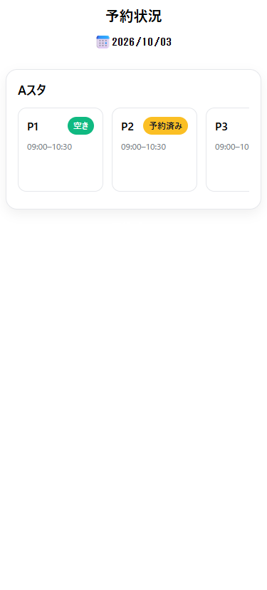
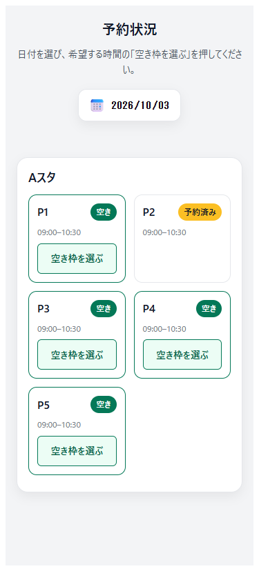

# 空き枠を選ぶ画面の改善

## 調査と範囲

2026年10月4日、接続Windows PCのEdgeをheadlessで起動し、375×812の画面で既存UIを確認した。API応答には架空のAスタ・P1〜P5を使った。右側の時間枠は横スクロールしないと読めず、空き枠はキーボードで選べなかった。下部の「予約する」は未実装の案内アラートで止まった。

18〜20歳の学生が日付と空き枠を探す場面を対象に、時間枠の一覧と操作の分かりやすさを改善する。対象学生によるユーザビリティテストは未実施であり、年齢に由来する好みは仮定しない。

## 参考

[GOV.UKのButton](https://design-system.service.gov.uk/components/button/)は、ラベルに実際の動作を書き、主操作を明確にするよう説明している。「空き枠を選ぶ」と次の操作を表示し、動作しない予約ボタンを除く判断に使った。

[W3CのReflow解説](https://www.w3.org/WAI/WCAG22/Understanding/reflow.html)を参考に、狭い画面では時間枠を折り返す。参考サイトの画像・ロゴ・CSSは取り込まない。

## 責務と契約

| proposal_id | 案・責務 | 依存と理由 | トレードオフ |
|---|---|---|---|
| PROP-slot-navigation | PeriodCardで空き枠をbuttonとして操作可能にする。StudioCardで枠を折り返す | 既存のslotDataとclickイベントを使う表示層の変更。予約可否は既存status判定を保つ | 縦に長くなるが、時間枠が横に隠れない |
| PROP-calendar-feedback | SchedulePageで読み込み・失敗・再試行を表示する | HTTP呼び出しは既存APIモジュール。業務モデルへUI状態を持ち込まない | 通信結果の画面確認にAPI fixtureを使うため、実APIの結合確認は別途必要 |

日付を変更したときは、最後に開始した取得の成功・失敗だけを表示する。古い応答は表示内容も読み込み状態も変更しない。取得ごとの番号は表示層の通信順制御であり、予約の業務状態を表さない。

空き枠を選んだだけでは予約を作成しない。フォームをキャンセルして別の枠を選び直せることを確認する。認証、全員のメール承認、受付業務、予約状態の変更は含めない。業務用語の追加・言語帳の変更は不要。

## TDD記録

| 順番 | 期待する動作 | Red | Green |
|---|---|---|---|
| 1 | Enter/Spaceで空き枠を選び、キャンセル後に別枠を選ぶ。予約済み枠は選べない | buttonが存在せずfocusで失敗 | button追加後1件成功 |
| 2 | 320pxで全時間枠が折り返し、実際の選び方を案内する | 案内がなく失敗 | 折り返し・案内追加後2件成功 |
| 3 | 読み込み中・失敗を伝え、同じ日付で再試行する | status要素がなく失敗 | 状態と案内追加後3件成功 |
| 4 | 日付変更後に旧応答が届いても表示を戻さない | 旧日の表示に戻って失敗 | 取得番号の照合後4件成功 |

Refactorでは不要になったCTAのスタイルと説明を除き、状態表示のコントラストと動きを整えた。再実行でも4件成功した。

## 検証

独立DDDレビューはAPPROVE。補足された旧失敗応答のケースを追加し、実装変更なしで成功した。この追加確認は新しいRed/Greenサイクルには数えない。

接続Windows PC上のEdgeで`npm run test:ui`が5件成功し、`npm run build`も成功した。APIはPlaywrightで架空データに置き換えている。実バックエンドとの予約作成は検証していない。キャンセルと別枠の選び直しではPOSTが発生しないことも確認した。

実行は`studio-frontend`で`npm ci`の後に`npm run test:ui`。Edgeを使用し、Viteを127.0.0.1:5174で起動する。手動では`npm run dev`で`/schedule`を開き、Tabで空き枠を選択してEnter、キャンセル後に別の枠を選ぶ。320px幅でも時間枠が横に隠れず、読込失敗時は再試行で復帰すれば合格とする。

CI、独立した型検査、lintは未設定。Vite buildの成功は型検査の成功を意味しない。フォーム全体のフォーカストラップ・Escape対応や予約送信結果は今回の改善範囲に含まない。

| 改善前・375px | 改善後・375px |
|---|---|
|  |  |
